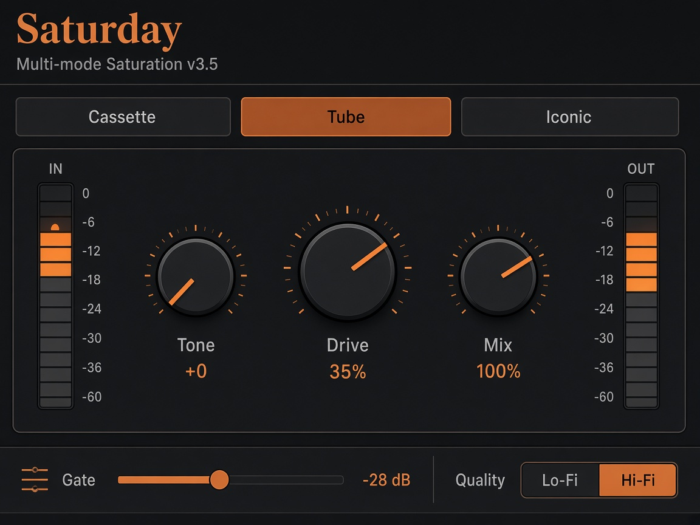
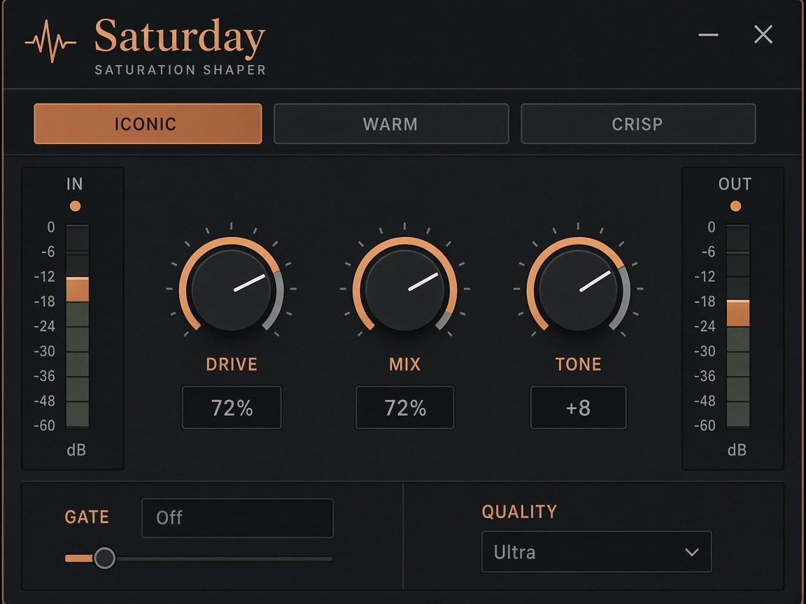

# Saturday

Multi-mode saturation — Cassette, Tube, and Iconic characters in one focused plugin.

**Author:** Whatever555 · **JSFX version:** 3.5 · **Native plugin:** 1.0.0  
**Modes:** Cassette · Tube · Iconic

Saturday is available in two forms:

| Format | Best for | UI |
|--------|----------|-----|
| **JSFX** | Reaper | Simple, lightweight custom UI |
| **VST3 / AU / Standalone** | Reaper and other DAWs | Full boutique copper-on-charcoal UI |

Both use the same DSP engine. Pick JSFX if you live in Reaper and want presets in the FX window; pick VST3 or AU if you want the full UI or need to run Saturday in Logic, Ableton, etc.



## What it does

Saturday adds warmth, weight, and character without a cluttered interface. Pick a mode, set Drive, shape with Tone, blend with Mix, and optionally gate saturation so it only kicks in above a level threshold.

- **Cassette** — worn vintage: wow, glue, softened highs
- **Tube** — mid-forward warmth and punch
- **Iconic** — polished presence and air that opens on louder material

## Install

### Reaper JSFX (quick install, macOS)

From this folder:

```bash
chmod +x install.sh
./install.sh
```

The script copies these files into Reaper’s JSFX folder:

```
~/Library/Application Support/REAPER/Effects/reaper-plugins/
  Saturday.jsfx
  Saturday.rpl
  Saturday.jsfx.rpl
```

On other platforms, set `REAPER_EFFECTS_DIR` before running if your Effects path differs:

```bash
REAPER_EFFECTS_DIR="$HOME/.config/REAPER/Effects/reaper-plugins" ./install.sh
```

### Reaper JSFX (manual install)

Copy **`Saturday.jsfx`** and **`Saturday.rpl`** into the same Reaper Effects directory:

| Platform | Path |
|----------|------|
| macOS | `~/Library/Application Support/REAPER/Effects/reaper-plugins/` |
| Windows | `%APPDATA%\REAPER\Effects\reaper-plugins\` |
| Linux | `~/.config/REAPER/Effects/reaper-plugins/` |

Also copy `Saturday.rpl` as `Saturday.jsfx.rpl` if factory presets do not appear in the preset dropdown (the install script does this automatically).

### After installing JSFX

1. **Restart Reaper**, or go to **Preferences → Plug-ins → VST → Re-scan** (JSFX are picked up on rescan).
2. Find the plugin at **FX → JS → reaper-plugins → Saturday**.
3. If presets are empty, remove and re-add the FX, or run `./install.sh` again.

### Native plugin — VST3 / AU (download, no Xcode required)

Pre-built binaries for **macOS**, **Windows**, and **Linux** are published on GitHub when a release is tagged:

**[Download latest release →](https://github.com/whatever555/Saturday/releases)**

| Download | Contents | Install location |
|----------|----------|------------------|
| `Saturday-macos.zip` | VST3 + AU (Apple Silicon & Intel) | See below |
| `Saturday-windows.zip` | VST3 | `%LOCALAPPDATA%\Programs\Common\VST3\` |
| `Saturday-linux.zip` | VST3 | `~/.vst3/` |

**macOS — after unzipping:**

```bash
chmod +x install-macos.sh && ./install-macos.sh
```

Or copy manually:

- `Saturday.vst3` → `~/Library/Audio/Plug-Ins/VST3/`
- `Saturday.component` → `~/Library/Audio/Plug-Ins/Components/`

**Linux — after unzipping:**

```bash
chmod +x install-linux.sh && ./install-linux.sh
```

**Windows — after unzipping:**

Copy the `Saturday.vst3` folder to your VST3 directory (e.g. `%LOCALAPPDATA%\Programs\Common\VST3\`), then rescan in your DAW.

**Load in a DAW**

| DAW | Menu path |
|-----|-----------|
| **Reaper** | FX → VST3: Whatever555 → Saturday (macOS: AU also available) |
| **Logic** | Audio FX → AU → Whatever555 → Saturday |
| **Ableton** | Audio Effects → VST3 → Whatever555 → Saturday |

Rescan or restart the DAW after installing.

**JSFX vs native in Reaper**

| | JSFX | VST3 / AU |
|---|------|-----------|
| UI | Simple | Full boutique UI |
| Factory presets (29) | Yes — `Saturday.rpl` in FX dropdown | Not yet — save DAW/plugin presets manually |
| CPU | Very light | Slightly higher (JUCE wrapper) |
| Install | `./install.sh` | Download from [Releases](https://github.com/whatever555/Saturday/releases) |

**Build from source (optional)**

Only needed if you want to hack on the plugin or no release exists yet for your platform. See **[plugin/README.md](plugin/README.md)**.

### Troubleshooting

**JSFX**

- **Plugin not listed** — Confirm `Saturday.jsfx` is directly in `reaper-plugins/`, not in a nested subfolder. Delete any old `reaper-plugins/saturday/` folder from a previous install.
- **Each preset shows as its own plugin** — Do not put individual `.preset` files in the Effects folder. Factory presets live in the single `Saturday.rpl` bank.
- **Stale UI after an update** — Remove the FX from the track and insert it again, or restart Reaper.

**VST3 / AU**

- **Plugin not listed after build** — Confirm the `.component` / `.vst3` exists under `~/Library/Audio/Plug-Ins/`, then rescan in the DAW.
- **UI looks old after a rebuild** — Remove the FX instance and insert it again (DAWs cache plugin UIs).
- **CMake fails with Unix Makefiles** — Use the Xcode generator: `cmake -B build -G Xcode`.

## Usage

### 1. Add Saturday to a track

**Reaper — JSFX**

1. Select a track or bus.
2. Click **FX** (or press `F`).
3. Choose **Add → JS → reaper-plugins → Saturday**.
4. Open the plugin window to use the custom UI (double-click the FX name in the chain if the window is closed).

**Reaper or other DAW — VST3 / AU**

1. Select a track or bus.
2. Open the FX / plug-in menu.
3. Choose **Saturday** under **Whatever555** (VST3 or AU).
4. Open the plugin window — the native UI opens automatically.

### 2. Choose a mode

Click **Cassette**, **Tube**, or **Iconic** at the top. Mode changes are crossfaded so you can switch during playback without clicks.



### 3. Set the main controls

| Control | What it does |
|---------|----------------|
| **Drive** | Saturation amount (0–100%) |
| **Tone** | Tilt EQ — darker/warmer (−) to brighter (+) |
| **Mix** | Wet/dry blend (0% = dry, 100% = full saturation) |

**IN** and **OUT** meters on the left and right show input and output levels.

### 4. Gate and Quality (footer)

| Control | What it does |
|---------|----------------|
| **Gate** | Threshold (−80 dB = off). Saturation only applies when input is above the threshold. Default: −28 dB. |
| **Quality** | Click to cycle **Standard → Hi-Fi → Ultra**. Higher settings reduce aliasing but use more CPU. |

### 5. Presets

**JSFX — factory presets**

Use the **preset dropdown** at the top of the Reaper FX window (not inside the custom UI). **29 factory presets** are included in `Saturday.rpl`.

If the list is empty after install, re-run `./install.sh`, rescan JSFX, or remove and re-add the plugin.

**VST3 / AU**

Factory presets from `Saturday.rpl` are not bundled in the native plugin yet. Save your own settings via the DAW’s preset system (Reaper: **+** in the FX window; Logic: plug-in settings menu; etc.).

### UI tips

- **Drag** knobs up/down to adjust values.
- **Ctrl+click** a knob to reset: Drive → 35%, Tone → 0, Mix → 100%.
- **Double-click** the Gate control to reset to −28 dB.
- **Shift+drag** Gate or knobs for finer adjustment.

### Quick mode comparison

To hear the modes clearly on the same source:

1. Set Gate to **Off** (drag fully left, or load **Cassette Night**, **Vocal Glow**, or **Neon Presence**).
2. Drive **40%**, Mix **100%**, Tone **0**.
3. Switch Cassette → Tube → Iconic on a vocal phrase or drum loop.

## Factory presets

Presets map to the visible controls plus **Quality** and **Gate**. Hidden legacy sliders (Output, Auto Gain) are ignored.

Some presets use Mix below 100% (e.g. **Acoustic Air** 60%, **Parallel Sat** 45%) for intentional parallel blending.

### Vocals

| Preset | Mode | Best for |
|--------|------|----------|
| Warm Tape | Cassette | General vocal warmth |
| Vocal Glow | Iconic | Gentle aura layer — 18% drive, 40% mix |
| Neon Presence | Iconic | Forward pop presence; 72% mix |
| Quiet Line | Cassette | Voiceover; warmth on words only |
| Ribbon Vocal | Tube | Smooth, dark vocal body |

### Drums & room

| Preset | Mode | Best for |
|--------|------|----------|
| Drum Punch | Tube | Kick and snare punch |
| Snare Crack | Tube | Snare transient bite |
| Room Glue | Tube | Overhead / room glue (68% mix) |

### Bass, guitar & DI

| Preset | Mode | Best for |
|--------|------|----------|
| Bass Thickener | Tube | Bass guitar weight |
| Tube Weight | Tube | Low-end density |
| Direct Heat | Tube | DI warmth and body |
| 12AX7 Push | Tube | Pushed guitar preamp mids |

### Keys, synth & strings

| Preset | Mode | Best for |
|--------|------|----------|
| Acoustic Air | Tube | Acoustic guitar presence |
| Sunlit Strings | Iconic | String shimmer (58% mix) |
| Synth Heat | Tube | Pads and synth harmonics |
| Icon Driver | Iconic | Aggressive synth lead |
| Cassette Night | Cassette | Worn cassette on keys |

### Bus, mix & master

| Preset | Mode | Best for |
|--------|------|----------|
| Mix Glue | Cassette | Group bus cohesion |
| Bus Character | Tube | Mix bus weight |
| Console Smoke | Tube | Parallel bus haze (38% mix) |
| Parallel Sat | Tube | NY parallel saturation |
| Bloom Stack | Iconic | Stack / bus harmonic bloom |
| Master Saturday | Cassette | Master bus finish |
| Tape Print | Cassette | Final print (4× OS) |

### Character & lo-fi

| Preset | Mode | Best for |
|--------|------|----------|
| Subtle Warmth | Cassette | Transparent color |
| 2 Inch Machine | Cassette | Classic fat tape |
| Heavy Tape | Cassette | Pushed tape crush |
| Lo-Fi Crush | Cassette | Aggressive degradation |
| Bright Tube | Tube | Bright, forward saturation |

## Technical notes

- Parameters are smoothed to prevent zipper noise.
- Nonlinear processing supports 2×/4× internal oversampling (Quality setting).
- Mode switches crossfade over 128 samples.
- DC blocking and soft limiting protect against unstable output.
- Default settings (Drive 0, Mix 100%) pass audio cleanly with minimal coloration.

## Files in this folder

| Path | Purpose |
|------|---------|
| `Saturday.jsfx` | Reaper JSFX source and UI |
| `Saturday.rpl` | Factory preset bank (29 presets, JSFX) |
| `Saturday-alt.rpl` | Alternate preset library name for some Reaper builds |
| `install.sh` | Installs JSFX into Reaper’s Effects folder |
| `plugin/` | Native VST3 / AU / Standalone project (JUCE) — see [plugin/README.md](plugin/README.md) |
| `docs/images/` | README screenshots |
